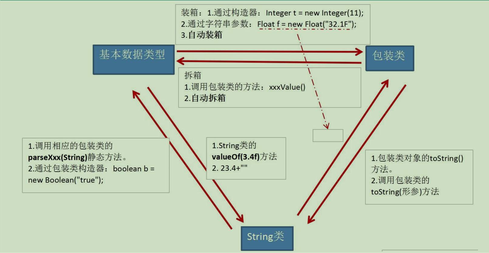

<div align='center'><span style="font-size: xxx-large; ">Java学习经验</span></div>

# 内存分配

* 栈内存：位于通用RAM（随机访问存储器）中，程序通过栈指针可以直接获取到存储在栈内存中的数据，运行效率仅次于寄存器。
* 堆内存：一种通用的内存池（也位于RAM区），用于存放所有的Java对象，运行速度要比栈内存花费更多的时间。

具体看博客[一文读懂Java对象的内存分配（附图详解）\_java把一个对象分别存到其他对象中内存-CSDN博客](https://blog.csdn.net/l312770312/article/details/115440729)

# 权限修饰符


|  修饰符  | 类内部 | 同一个包 | 不同包的子类 | 同一个工程 |
| :-------: | :----: | :------: | :----------: | :--------: |
|  private  |  yes  |          |              |            |
|  default  |  yes  |   yes   |              |            |
| protected |  yes  |   yes   |     yes     |            |
|  public  |  yes  |   yes   |     yes     |    yes    |

# this关键字

* 它在方法内部使用，即这个方法所属对象的引用。
* 它在构造器内部使用，表示该构造器正在初始化的对象

**注意**：

> * 可以在类的构造中使用"this(形参列表)"的方式，调用本类中重载的其他的构造器！
> * 明确：构造器中不能通过"this(形参列表)"的方式调用自身构造器
> * 如果一个类中声明了n个构造器，则最多有 n - 1个构造器中使用了"this(形参列表)"
> * "this(形参列表)"必须声明在类的构造器的首行！
> * 在类的一个构造器中，最多只能声明一个"this(形参列表)"

# 继承

只能单继承或多层继承，不能多个继承。

## super

1. 在Java类中使用super来调用父类中的指定操作：
   * super可用于访问父类中定义的属性
   * super可用于调用父类中定义的成员方法
   * super可用于在子类构造器中调用父类的构造器
2. 注意：
   * 尤其当子父类出现同名成员时，可以用super表明调用的是父类中的成员
   * <font color='red'>super的追溯不仅限于直接父类</font>
   * super和this的用法相像，this代表本类对象的引用，super代表父类的内存
     空间的标识

# 多态

## instanceof

x instanceof A：检验x是否为类A的对象，返回值为boolean型。

* 要求x所属的类与类A必须是子类和父类的关系，否则编译错误。
* 如果x属于类A的子类B，x instanceof A值也为true。

## 多态是编译时行为还是运行时行为？

&emsp;在Java中，编译器会根据变量的声明类型来确定可以调用的方法和属性。这称为静态绑定（Static Binding）或编译时绑定（Compile-time Binding）。编译器会检查方法和属性是否存在于声明类型中，并进行相应的静态类型检查。

&emsp;然而，在运行时，Java虚拟机会根据对象的实际类型来确定要执行的方法。这被称为动态绑定（Dynamic Binding）或运行时绑定（Runtime Binding）。它是多态的核心概念。通过动态绑定，程序能够在运行时根据实际对象的类型来决定调用哪个具体的方法。

&emsp;因此，<font color='red'>多态是一种运行时行为</font>，它允许在不同的对象上调用相同的方法名，但根据对象的实际类型执行不同的行为。这种动态的特性使得程序更加灵活、可扩展，并提高了代码的重用性。

## 包装类Wrapper


| 基本数据类型 |  包装类  |
| :----------: | :-------: |
|     byte     |   Byte   |
|    short    |   Short   |
|     int     |  Integer  |
|     long     |   Long   |
|    float    |   Float   |
|    double    |  Double  |
|   boolean   |  Boolean  |
|     char     | Character |



# 代码块

* 代码块(或初始化块)的作用：`对Java类或对象进行初始化`
* 代码块(或初始化块)的分类：一个类中代码块若有修饰符，则只能被static修饰，称为静态代码块(static block)，没有使用static修饰的，为非静态代码块。
* static代码块通常用于初始化static的属性

## 静态代码块

1. 可以有输出语句。
2. 可以对类的属性、类的声明进行初始化操作。
3. 不可以对非静态的属性初始化。即：不可以调用非静态的属性和方法。
4. 若有多个静态的代码块，那么按照`从上到下`的顺序依次执行。
5. 静态代码块的执行要<font color='red'>先于</font>非静态代码块。
6. 静态代码块随着类的加载而加载，且<font color='red'>只执行一次。</font>

## 非静态代码块

1. 可以有输出语句。
2. 可以对类的属性、类的声明进行初始化操作。
3. 除了调用非静态的结构外，还可以调用静态的变量或方法。
4. 若有多个非静态的代码块，那么按照从`上到下`的顺序依次执行。
5. 每次创建对象的时候，都会执行一次。且<font color='red'>先于</font>构造器执行。

# final关键字

* final标记的类不能被继承。提高安全性，提高程序的可读性
* final标记的方法不能被子类重写。
* final标记的变量(成员变量或局部变量)即称为常量。名称大写，且只能被赋值一次。

# 抽象(abstract)

* 用abstract关键字来修饰一个类，这个类叫做抽象类。
* 用abstract来修饰一个方法，该方法叫做抽象方法。只有方法的声明，没有方法的实现。以分号结束。
* 含有抽象方法的类必须被声明为抽象类。
* 抽象类不能被实例化。抽象类是用来被继承的，抽象类的子类必须重写父类的抽象方法，并提供方法体。若没有重写全部的抽象方法，仍为抽象类。
* 不能用abstract修饰变量、代码块、构造器
* 不能用abstract修饰私有方法、静态方法、final的方法、final的类

&emsp;抽象类体现的就是一种模板模式的设计，抽象类作为多个子类的通用模板，子类在抽象类的基础上进行扩展、改造，但子类总体上会保留抽象类的行为方式。
**解决的问题：**

* 当功能内部一部分实现是确定的，一部分实现是不确定的。这时可以把不确定的部分暴露出去，让子类去实现。
* 换句话说，在软件开发中实现一个算法时，整体步骤很固定、通用，这些步骤已经在父类中写好了。但是某些部分易变，易变部分可以抽象出来，供不同子类实现。这就是一种模板模式。

# 接口(interface)

1. 接口(interface)是抽象方法和常量值定义的集合。
2. 接口的特点：

   * 用interface来定义
   * 接口的所有成员变量都默认是由public static final修饰的。
   * 接口的所有抽象方法都默认是由public abstract修饰的。
   * 接口中没有构造器
   * 接口采用多继承机制
3. 接口举例

   ```java
   public interface Runner{
       int ID = 1;
       void start();
       public void run();
       void stop();
   }
   ```

   ```java
   public interface Runner{
       public static final int ID = 1;
       public abstract void start();
       public abstract void run();
       public abstract void stop();
   }
   ```
4. 接口的默认方法

   * 若一个接口中定义了一个默认方法，而另外一个接口中也定义了一个同名同参数的方法（不管此方法是否是默认方法），在实现类同时实现了这两个接口时，会出现：**接口冲突**。
     &emsp;解决办法：实现类必须覆盖接口中同名同参数的方法，来解决冲突。
   * 若一个接口中定义了一个默认方法，而父类中也定义了一个同名同参数的非抽象方法，则不会出现冲突问题。因为此时遵守：类优先原则。接口中具有相同名称和参数的默认方法会被忽略。

# 匿名内部类

语法格式：

```java
父类/接口 对象名 = new 父类/接口() {
    // 匿名内部类的定义
};
```

实例代码：

```java
interface Greeting {
    void greet();
}

public class Main {
    public static void main(String[] args) {
        Greeting greeting = new Greeting() {
            @Override
            public void greet() {
                System.out.println("Hello, world!");
            }
        };

        greeting.greet(); // 输出：Hello, world!
    }
}
```

# 线程

## 基本概念：程序、进程、线程

* 程序(program)是为完成特定任务、用某种语言编写的一组指令的集合。即指一段静态的代码，静态对象。
* 进程(process)是程序的一次执行过程，或是正在运行的一个程序。是一个动态的过程：有它自身的产生、存在和消亡的过程。——生命周期
* 线程(thread)，进程可进一步细化为线程，是一个程序内部的一条执行路径。
  1. 若一个进程同一时间并行执行多个线程，就是支持多线程的
  2. 线程作为调度和执行的单位，每个线程拥有独立的运行栈和程序计数器(pc)，线程切换的开销小
  3. 一个进程中的多个线程共享相同的内存单元/内存地址空间它们从同一堆中分配对象，可以访问相同的变量和对象。这就使得线程间通信更简便、高效。但多个线程操作共享的系统资源可能就会带来安全的隐患。

## 线程的创建和使用

* 线程的创建有两种方法：

  1. 继承Thread类

  ```java
  class My extends Thread{
      public void run(){}
  }
  class Test{
      public static void main(string[] args){
          My my = new My();
          my.start();
      }
  }
  ```

  2. 实现Runnable接口(多个线程可共享同一个接口实现类的对象，非常适合多个相同线程来处理同一份资源)：

  ```java
  class My implements Runnable{
      run(){}
  }
  class Test{
      public static void main(string[] args){
          My my = new My();
          new Thread(my).start();
      }
  }
  ```
* 执行`start()`方法，才会开启一个线程，`run()`只是一个方法。在当前线程中调用`start()`，会开启新的线程并执行该线程中`run()`方法，且是异步执行。
* 关于线程的执行权，并不是执行权高先执行，而是执行权高执行的概率高。
* 线程的生命周期：
  

## 同步代码块

* 格式:

```java
synchronized(同步监视器){
    // 需要被同步的代码  
}
```

* 说明:

> `需要被同步的代码`，即为操作共享数据的代码
>
> `共享数据`，即为多个线程需要操作的数据。比如卖票中的票
>
> `需要被同步的代码`：在被`synchronized`包裹以后，就使得一个线程在操作这些代码的过程中，其它线程必须等待。
>
> `同步监视器`：俗称锁。哪个线程获取了锁，哪个线程就能执行需要被同步的代码。
>
> 同步监视器可以使用任何一个类的对象充当。但是，多个线程必须共用同一个同步监视器。

* 代码案例：

同步前：（运行会出现重票等情况）

```java
public class Test {
    public static void main(String[] args) {
        Ticket t = new Ticket();
        Thread t1 = new Thread(t);
        Thread t2 = new Thread(t);
        Thread t3 = new Thread(t);
        t1.setName("t1窗口");
        t2.setName("t2窗口");
        t3.setName("t3窗口");
        t1.start();
        t2.start();
        t3.start();
    }
}

class Ticket implements Runnable {
    private int tick = 100;

    public void run() {
        while (true) {
            if (tick > 0) {
                try {
                    Thread.sleep(100);
                } catch (InterruptedException e) {
                    throw new RuntimeException(e);
                }
                System.out.println(Thread.currentThread
                        ().getName() + "售出车票，tick号为：" +
                        tick--);
            } else
                break;
        }
    }
}
```
同步：
```java
public class Test {
    public static void main(String[] args) {
        Ticket t = new Ticket();
        Thread t1 = new Thread(t);
        Thread t2 = new Thread(t);
        Thread t3 = new Thread(t);
        t1.setName("t1窗口");
        t2.setName("t2窗口");
        t3.setName("t3窗口");
        t1.start();
        t2.start();
        t3.start();
    }
}

class Ticket implements Runnable {
    private int tick = 100;

    public void run() {
        while (true) {
            // 这个try只是加大其他线程参与概率
            try {
                Thread.sleep(5);
            } catch (InterruptedException e) {
                throw new RuntimeException(e);
            }
            synchronized (this) {
                if (tick > 0) {
                    try {
                        Thread.sleep(10);
                    } catch (InterruptedException e) {
                        throw new RuntimeException(e);
                    }
                    System.out.println(Thread.currentThread
                            ().getName() + "售出车票，tick号为：" +
                            tick--);
                } else
                    break;
            }
        }
    }
}
```

## 线程通信

* `wait()`: 线程一旦执行此方法，就进入等待状态。同时，释放对同步监视器的调用
* `notify()`: 一旦执行此方法，就唤醒被wait()的线程中优先级最高的线程，优先级相同则随机唤醒。被唤醒的线程从当初wait的位置继续执行。
* `notifyAll()`:唤醒所有wait的线程

**注意**
* 此三个方法都要在同步代码块或同步方法中
* 此三个方法的调用者必须是同步监视器
* 此三个方法声明在Object类中

案例：生产者生产包子（<=20），消费者消费包子
实现文件：D:\JavaCode\IDEA_JavaSenoir\Thread\src\Communication\Exer\ProductTest.java

# 反射（Reflection）

* Reflection（反射）是被视为动态语言的关键，反射机制允许程序在执行期借助于Reflection API取得任何类的内部信息，并能直接操作任意对象的内部属性及方法。
* 加载完类之后，在堆内存的方法区中就产生了一个Class类型的对象（一个类只有一个Class对象），这个对象就包含了完整的类的结构信息。我们可以通过这个对象看到类的结构。这个对象就像一面镜子，透过这个镜子看到类的结构，所以，我们形象的称之为：反射。

## 类的加载过程

类的加载(Load)-->类的链接(Link)-->类的初始化(Initialize)
* 类的加载：将类的class文件读入内存，并为之创建一个java.lang.Class对象。此对象由类加载器完成。
* 类的链接：将类的二进制数据合并到JRE中
* JVM负责对类进行初始化

不会自己查去